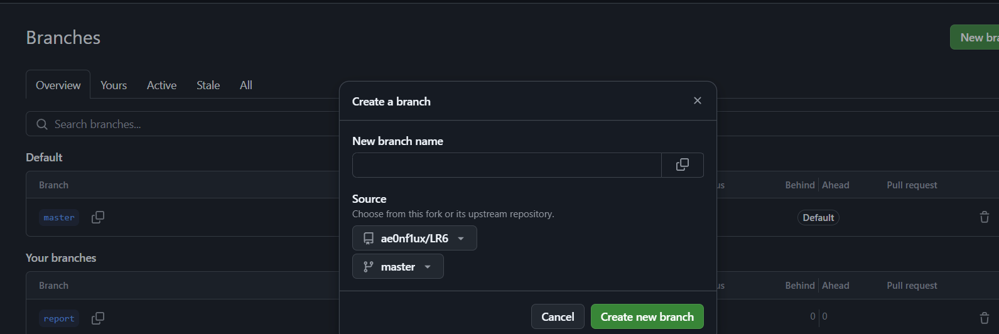

# LR6
Лабораторная работа №6
# LR6
Лабораторная работа №6

# Отчет по работе с Git

## 1. Создание форка
Сделана копия в личное хранилище из https://github.com/ae0nf1ux/LR6.git

## 2. Настройка клиента git
Команда для изменения имени пользователя:

```bash
$ git config --global user.name "4318 Маликов А.А."
```
Команда для изменения почты пользователя:

```bash
$ git config --global user.email "malikovalmaz24@yandex.ru"
```
*Результаты изменения имени и почты пользователя*  


## 3. Клонирование репозитория

```bash
$ git clone https://github.com/ae0nf1ux/LR6.git
```
*Скриншот клонирования* 


## 4. Добавление нового файла
*Скриншот с добавлением нового файла*


## 5. Добавление изменений в локальный репозиторий

```bash
$ git pull
```
*Изменения данных в локальном репозитории*


## 6. Получение данных для каждой из веток

```bash
$ git log --all
```
*Результат работы команды*


## 7. Просмотр последних изменений

```bash
$ git show
```
*Результат работы команды*


## 8. Создание новой ветки
*Результат добавления новой ветки*


## 9. Слияние веток

```bash
$ git merge branch1
```
*Выполнено слияние веток*


## 10. Удаление побочной ветки после слияния

```bash
$ git push origin --delete branch1
```
*Удалил побочную ветку*


## 11. Сделал несколько изменений, закоммитив их с комментариями

*Скриншот коммитов*


*Запушил коммиты*

## 12. Откат коммита
Удаление последнего коммита с помощью команды:

```bash
$ git revert <HASH_ID>
```
*Скриншот отката*


