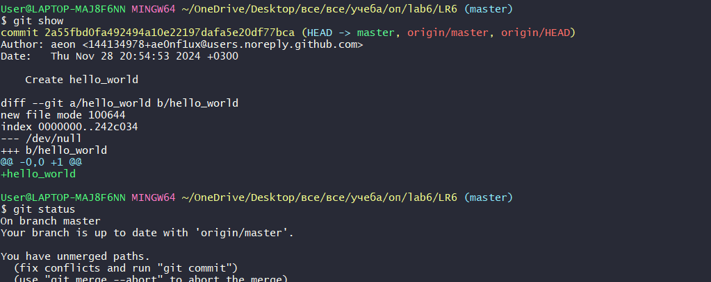

# LR6
Лабораторная работа №6
# Отчет по работе с Git

## 1. Создание форка
Сделана копия в личное хранилище из https://github.com/ae0nf1ux/LR6.git

## 2. Настройка клиента git
Команда для изменения имени пользователя:

```bash
$ git config --global user.name "4318 Маликов А.А."
```
Команда для изменения почты пользователя:

```bash
$ git config --global user.email "malikovalmaz24@yandex.ru"
```
*Результаты изменения имени и почты пользователя*  


## 3. Клонирование репозитория

```bash
$ git clone https://github.com/ae0nf1ux/LR6.git
```
*Скриншот клонирования* 


## 4. Добавление нового файла
*Скриншот с добавлением нового файла*


## 5. Добавление изменений в локальный репозиторий

```bash
$ git pull
```
*Изменения данных в локальном репозитории*


## 6. Получение данных для каждой из веток

```bash
$ git log --all
```
*Результат работы команды*


## 7. Просмотр последних изменений

```bash
$ git show
```
*Результат работы команды*




## 8. Создание новой ветки
*Результат добавления новой ветки*


## 9. Слияние веток

```bash
$ git merge branch1
```
*Выполнено слияние веток*


## 10. Удаление побочной ветки после слияния

```bash
$ git push origin --delete branch1
```
*Удалил побочную ветку*


## 11. Сделал несколько изменений, закоммитив их с комментариями

*Скриншот коммитов*


*Запушил коммиты*

## 12. Откат коммита
Удаление последнего коммита с помощью команды:

```bash
$ git revert <HASH_ID>
```
*Скриншот отката*


## 13. Получение истории операций в форматированном виде

```bash
$ git log --pretty=format:"%h %ad %an %s" --date=short
```

## 14. История операций
Список истории операций:
```
1977684 2024-11-29 aeon Update README.md
f2a1eca 2024-11-29 aeon Update README.md
7749a42 2024-11-29 4318 Маликов А.А. создать скриншоты
3c3d941 2024-11-28 4318 Маликов А.А. Revert "изменение 1"
fce64bf 2024-11-28 4318 Маликов А.А. изменение 2
7ed4064 2024-11-28 4318 Маликов А.А. изменение 1
50ecf19 2024-11-28 4318 Маликов А.А. разрешение конфликта
2a55fbd 2024-11-28 aeon Create hello_world
921f53b 2020-11-21 Kurtyanik Обновление информации
0f9f50d 2020-11-21 Kurtyanik Заполнил файл
c08a654 2020-11-21 Kurtyanik Файл создан пустым
3c6e913 2020-11-21 Kurtyanik Initial commit
```

## 15. Вывод
В ходе выполнения работы я повторил базовые возможности системы управления версиями, получил опыт работы с Git Api, опыт работы с локальным и удаленным репозиторием.
